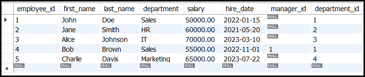
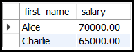

# **Basic SQL Syntax**  

## **Introduction**  
SQL (Structured Query Language) is a standard programming language for managing and manipulating relational databases. It allows users to store, retrieve, update, and delete data using structured commands. SQL follows a **structured syntax** that must be followed correctly to execute queries without errors.  

---

## **Example Table** ```employees```


---

## **What is SQL Syntax?**  
SQL syntax refers to the set of rules defining the correct way to write SQL statements. These rules include using proper keywords, table names, column names, conditions, and operators in the correct sequence.  

### **Content:**  
- SQL commands are case-insensitive, but writing keywords in **uppercase** is a best practice.  
- Every SQL command ends with a semicolon (`;`).  
- SQL uses predefined keywords such as `SELECT`, `INSERT`, `UPDATE`, and `DELETE` to interact with databases.  
- Queries should follow the logical sequence of operations.  

### **Syntax:**  
A basic SQL query structure:  
```sql
SELECT column1, column2 FROM table_name WHERE condition;
```

### **Statement related to the `employees` table:**  
To retrieve all employee records:  
```sql
SELECT * FROM employees;
```


---

# **SQL Keywords**  

## **What are SQL Keywords?**  
SQL keywords are **reserved words** that perform specific database operations. They cannot be used as table or column names.  

### **Content:**  
Some commonly used SQL keywords include:  
- `SELECT` – Retrieves data from a database table.  
- `INSERT` – Adds new records to a table.  
- `UPDATE` – Modifies existing records in a table.  
- `DELETE` – Removes records from a table.  
- `WHERE` – Filters records based on conditions.  
- `ORDER BY` – Sorts retrieved data.  
- `GROUP BY` – Groups data based on specified columns.  
- `HAVING` – Filters grouped data.  

### **Syntax:**  
Using SQL keywords in a query:  
```sql
SELECT first_name, salary FROM employees WHERE salary > 60000 ORDER BY salary DESC;
```

### **Statement related to the `employees` table:**  
To list employees earning more than 60,000 in descending order:  
```sql
SELECT first_name, salary FROM employees WHERE salary > 60000 ORDER BY salary DESC;
```


---

# **Data Types**  

## **What are SQL Data Types?**  
SQL **data types** define the type of values that can be stored in columns of a table. Choosing the correct data type ensures data integrity and efficient storage.  

### **Content:**  
SQL data types are categorized as:  
1. **Numeric Types**: `INT`, `DECIMAL`, `FLOAT`, `DOUBLE`  
2. **String Types**: `VARCHAR(n)`, `TEXT`, `CHAR(n)`  
3. **Date & Time Types**: `DATE`, `DATETIME`, `TIMESTAMP`  
4. **Boolean Type**: `BOOLEAN`  

### **Syntax:**  
Defining a table with different data types:  
```sql
CREATE TABLE employees (
    employee_id INT PRIMARY KEY AUTO_INCREMENT,
    first_name VARCHAR(50) NOT NULL,
    last_name VARCHAR(50) NOT NULL,
    department VARCHAR(50),
    salary DECIMAL(10, 2),
    hire_date DATE,
    manager_id INT,
    department_id INT
);
```

### **Statement related to the `employees` table:**  
To check the structure of the table:  
```sql
DESCRIBE employees;
```


---

# **Operators**  

## **What are SQL Operators?**  
SQL **operators** are used to perform calculations, comparisons, and logical operations in queries.  

### **Content:**  
Types of operators in SQL:  
1. **Arithmetic Operators:** `+`, `-`, `*`, `/`  
2. **Comparison Operators:** `=`, `!=`, `>`, `<`, `>=`, `<=`  
3. **Logical Operators:** `AND`, `OR`, `NOT`  
4. **LIKE Operator:** Used for pattern matching.  

### **Syntax:**  
Using operators in SQL:  
```sql
SELECT first_name, salary FROM employees WHERE salary > 60000;
```


### **Statement related to the `employees` table:**  
To find employees whose name starts with 'J':  
```sql
SELECT * FROM employees WHERE first_name LIKE 'J%';
```


---

# **SELECT & INSERT**  

## **What are SELECT and INSERT Commands?**  
- `SELECT` is used to retrieve data from a table.  
- `INSERT` is used to add new records into a table.  

### **Content:**  
- The `SELECT` statement can filter, sort, and group results.  
- The `INSERT` statement requires column names and values to be inserted.  

### **Syntax:**  
Selecting data:  

```sql
SELECT first_name, salary FROM employees WHERE salary > 60000;
```


Inserting data:  
```sql
INSERT INTO employees (first_name, last_name, department, salary, hire_date, manager_id, department_id)
VALUES ('John', 'Doe', 'Sales', 50000, '2022-01-15', NULL, 1),
       ('Jane', 'Smith', 'HR', 60000, '2021-05-20', NULL, 2),
       ('Alice', 'Johnson', 'IT', 70000, '2023-03-10', NULL, 3),
       ('Bob', 'Brown', 'Sales', 55000, '2022-11-01', 1, 1),
       ('Charlie', 'Davis', 'Marketing', 65000, '2023-07-22', NULL, 4);
```

---

# **UPDATE & DELETE**  

## **What are UPDATE and DELETE Commands?**  
- `UPDATE` modifies existing records.  
- `DELETE` removes specific records from a table.  

### **Content:**  
- The `UPDATE` statement modifies records based on a `WHERE` condition.  
- The `DELETE` statement removes records permanently.  

### **Syntax:**  
Updating a record:  
```sql
UPDATE employees SET salary = 90000 WHERE first_name = 'John';
```


Deleting a record:  
```sql
DELETE FROM employees WHERE salary >= 90000;
```



---

# **Statements**  

## **What are SQL Statements?**  
SQL statements define how data is stored, modified, and retrieved in databases.  

### **Content:**  
SQL statements are categorized into:  
1. **DDL (Data Definition Language):**  
   - `CREATE`, `ALTER`, `DROP`  
2. **DML (Data Manipulation Language):**  
   - `SELECT`, `INSERT`, `UPDATE`, `DELETE`  
3. **DCL (Data Control Language):**  
   - `GRANT`, `REVOKE`  
4. **TCL (Transaction Control Language):**  
   - `COMMIT`, `ROLLBACK`  

---

