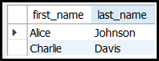

# SQL Data Types

SQL data types are the foundation of database design. They define the kind of data that can be stored in a column, ensuring data integrity, optimizing storage, and enabling efficient querying. This guide provides a comprehensive and detailed exploration of SQL data types, their categories, use cases, and best practices.

---

## **Example Table**


---

## What Are SQL Data Types?
SQL data types specify the type of data that a column can store. Each column in a table must have a defined data type, which determines:
- **The kind of data**: Numbers, text, dates, binary data, etc.
- **Storage requirements**: How much space the data occupies.
- **Operations allowed**: What operations (e.g., arithmetic, comparisons) can be performed on the data.

Different database systems (e.g., MySQL, PostgreSQL, SQL Server) may have slight variations in data types, but the core concepts remain consistent.

---

## Categories of SQL Data Types

### 1. Numeric Data Types
Numeric data types are used to store numbers, including integers, decimals, and floating-point values.

#### Integer Types
- **INT**: A 4-byte integer. Range: `-2,147,483,648` to `2,147,483,647`.
  - Example: `42`
- **SMALLINT**: A 2-byte integer. Range: `-32,768` to `32,767`.
  - Example: `32767`
- **BIGINT**: An 8-byte integer. Range: `-9,223,372,036,854,775,808` to `9,223,372,036,854,775,807`.
  - Example: `9223372036854775807`
- **TINYINT**: A 1-byte integer. Range: `0` to `255` (unsigned) or `-128` to `127` (signed).
  - Example: `127`

#### Decimal and Floating-Point Types
- **DECIMAL(p, s)**: A fixed-point number with precision `p` (total digits) and scale `s` (digits after the decimal point).
  - Example: `DECIMAL(5, 2)` can store `123.45`.
- **NUMERIC(p, s)**: Synonym for `DECIMAL`.
- **FLOAT**: A single-precision floating-point number. Approximate value with 4 bytes.
  - Example: `3.14`
- **DOUBLE**: A double-precision floating-point number. Approximate value with 8 bytes.
  - Example: `3.1415926535`

#### Use Cases
- Use `INT` for whole numbers like IDs or counts.
- Use `DECIMAL` for precise calculations like monetary values.
- Use `FLOAT` or `DOUBLE` for scientific calculations where precision is less critical.

---

### 2. String Data Types
String data types store text or character data. They can be fixed-length or variable-length.

#### Fixed-Length Strings
- **CHAR(n)**: Fixed-length character string. Pads with spaces if the input is shorter than `n`.
  - Example: `CHAR(10)` stores `"Hello     "`.
- **NCHAR(n)**: Fixed-length Unicode string. Used for multilingual text.
  - Example: `NCHAR(10)` stores `"こんにちは"`.

#### Variable-Length Strings
- **VARCHAR(n)**: Variable-length character string. Stores up to `n` characters without padding.
  - Example: `VARCHAR(255)` stores `"Hello"`.
- **NVARCHAR(n)**: Variable-length Unicode string.
  - Example: `NVARCHAR(255)` stores `"こんにちは"`.

#### Large Text Data
- **TEXT**: Stores large text data (up to 2GB or more, depending on the database).
  - Example: `"This is a long text."`
- **NTEXT**: Stores large Unicode text data.

#### Use Cases
- Use `CHAR` for fixed-length data like country codes.
- Use `VARCHAR` for variable-length data like names or addresses.
- Use `TEXT` for large text fields like descriptions or comments.

---

### 3. Date and Time Data Types
Date and time data types store temporal data, such as dates, times, and timestamps.

#### Date and Time
- **DATE**: Stores a date in `YYYY-MM-DD` format.
  - Example: `2023-10-25`
- **TIME**: Stores a time in `HH:MM:SS` format.
  - Example: `14:30:00`
- **DATETIME**: Stores both date and time.
  - Example: `2023-10-25 14:30:00`
- **TIMESTAMP**: Stores a timestamp (date and time, often with timezone support).
  - Example: `2023-10-25 14:30:00 UTC`

#### Specialized Types
- **YEAR**: Stores a year value.
  - Example: `2023`
- **INTERVAL**: Stores a time interval.
  - Example: `INTERVAL '1' DAY`

#### Use Cases
- Use `DATE` for storing birthdates or event dates.
- Use `DATETIME` or `TIMESTAMP` for recording exact moments (e.g., log entries).
- Use `TIME` for storing specific times (e.g., meeting times).

---

### 4. Boolean Data Type
Boolean data types store true/false values.

- **BOOLEAN** or **BOOL**: Stores `TRUE` or `FALSE`.
  - Example: `TRUE`

#### Use Cases
- Use for flags or status indicators (e.g., `is_active`, `is_completed`).

---

### 5. Binary Data Types
Binary data types store binary data, such as images, files, or raw bytes.

#### Fixed-Length Binary
- **BINARY(n)**: Fixed-length binary data.
  - Example: `BINARY(10)` stores 10 bytes of binary data.

#### Variable-Length Binary
- **VARBINARY(n)**: Variable-length binary data.
  - Example: `VARBINARY(255)` stores up to 255 bytes of binary data.

#### Large Binary Objects
- **BLOB**: Stores large binary objects (up to 2GB or more).
  - Example: An image file.
- **LONGBLOB**: Stores very large binary objects.

#### Use Cases
- Use `BLOB` for storing files like images or documents.
- Use `BINARY` for fixed-length binary data like hashes.

---

### 6. Other Data Types
Other specialized data types include:

#### JSON
- **JSON**: Stores JSON-formatted data.
  - Example: `{"name": "John", "age": 30}`

#### Arrays
- **ARRAY**: Stores an array of values.
  - Example: `[1, 2, 3]`

#### Enumerations
- **ENUM**: Stores a value from a predefined list.
  - Example: `ENUM('Red', 'Green', 'Blue')`

#### UUID
- **UUID**: Stores a universally unique identifier.
  - Example: `123e4567-e89b-12d3-a456-426614174000`

#### Use Cases
- Use `JSON` for storing structured data like configuration settings.
- Use `ARRAY` for storing lists of values.
- Use `ENUM` for columns with a fixed set of possible values (e.g., statuses).

---

## Choosing the Right Data Type
When selecting a data type, consider the following factors:

1. **Data Nature**:
   - What kind of data will be stored? (e.g., numbers, text, dates)
2. **Storage Efficiency**:
   - Use the smallest data type that can accommodate your data to save space.
3. **Performance**:
   - Certain data types (e.g., `INT`) are faster to process than others (e.g., `VARCHAR`).
4. **Data Integrity**:
   - Use constraints like `NOT NULL`, `UNIQUE`, or `CHECK` to enforce rules.
5. **Future-Proofing**:
   - Choose data types that can accommodate potential future requirements.

---

## SQL Data Type Examples

### Example 1: Creating a Table with Different Data Types
```sql
CREATE TABLE employees (
    employee_id INT PRIMARY KEY AUTO_INCREMENT,
    first_name VARCHAR(50) NOT NULL,
    last_name VARCHAR(50) NOT NULL,
    department VARCHAR(50),
    salary DECIMAL(10, 2),
    hire_date DATE,
    manager_id INT,
    department_id INT
);
```

### Example 2: Inserting Data
```sql
INSERT INTO employees (first_name, last_name, department, salary, hire_date, manager_id, department_id)
VALUES ('John', 'Doe', 'Sales', 50000, '2022-01-15', NULL, 1),
       ('Jane', 'Smith', 'HR', 60000, '2021-05-20', NULL, 2),
       ('Alice', 'Johnson', 'IT', 70000, '2023-03-10', NULL, 3),
       ('Bob', 'Brown', 'Sales', 55000, '2022-11-01', 1, 1),
       ('Charlie', 'Davis', 'Marketing', 65000, '2023-07-22', NULL, 4);
```

### Example 3: Querying Data
```sql
SELECT first_name, last_name
FROM employees
WHERE hire_date > '2023-01-01';
```


---

## Conclusion
SQL data types are essential for defining the structure and behavior of your database. By understanding the different categories and their use cases, you can design efficient and reliable database schemas. Always refer to your specific database system's documentation for additional data types and features.

For further learning, explore advanced topics like:
- Custom data types
- Indexing and performance optimization
- Data type conversion and casting
- Handling time zones and localization.


---
