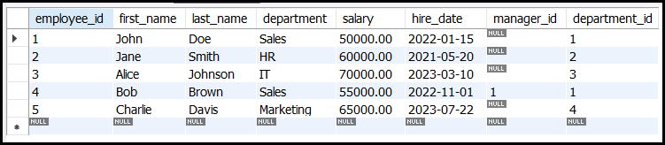
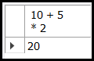

# Operators in MySQL

Operators in MySQL are symbols or keywords used to perform operations on data. They are essential for constructing queries, filtering results, and manipulating data. This guide provides an in-depth look at the different types of operators in MySQL, their syntax, and usage examples.

---

## **Example Table** ```employees```



---

## What Are Operators in MySQL?
Operators are used to:
- Perform calculations (e.g., addition, subtraction).
- Compare values (e.g., equality, inequality).
- Combine conditions (e.g., AND, OR).
- Manipulate data (e.g., bitwise operations).

Operators are used in `SELECT`, `UPDATE`, `DELETE`, and other SQL statements to filter, transform, and analyze data.

---

## Types of Operators

### 1. Arithmetic Operators
Arithmetic operators perform mathematical operations on numeric values.

| Operator | Description           | Example          |
|----------|-----------------------|------------------|
| `+`      | Addition              | `10 + 5` → `15`  |
| `-`      | Subtraction           | `10 - 5` → `5`   |
| `*`      | Multiplication        | `10 * 5` → `50`  |
| `/`      | Division              | `10 / 5` → `2`   |
| `%`      | Modulus (remainder)   | `10 % 3` → `1`   |
| `DIV`    | Integer division      | `10 DIV 3` → `3` |

#### Example
```sql
SELECT 10 + 5 AS sum, 10 * 5 AS product;
```


---

### 2. Comparison Operators
Comparison operators compare two values and return `TRUE`, `FALSE`, or `NULL`.

| Operator | Description                     | Example               |
|----------|---------------------------------|-----------------------|
| `=`      | Equal to                        | `10 = 5` → `FALSE`    |
| `!=`     | Not equal to                    | `10 != 5` → `TRUE`    |
| `<>`     | Not equal to (alternative)      | `10 <> 5` → `TRUE`    |
| `>`      | Greater than                    | `10 > 5` → `TRUE`     |
| `<`      | Less than                       | `10 < 5` → `FALSE`    |
| `>=`     | Greater than or equal to        | `10 >= 5` → `TRUE`    |
| `<=`     | Less than or equal to           | `10 <= 5` → `FALSE`   |
| `<=>`    | NULL-safe equal to              | `NULL <=> NULL` → `TRUE` |

#### Example
```sql
SELECT * FROM employees WHERE salary > 50000;
```
This query retrieves all employees with a salary greater than 50,000.


---

### 3. Logical Operators
Logical operators combine multiple conditions.

| Operator | Description                     | Example                               |
|----------|---------------------------------|---------------------------------------|
| `AND`    | TRUE if all conditions are TRUE | `10 > 5 AND 5 < 3` → `FALSE`         |
| `OR`     | TRUE if any condition is TRUE   | `10 > 5 OR 5 < 3` → `TRUE`           |
| `NOT`    | Negates a condition             | `NOT (10 > 5)` → `FALSE`             |
| `XOR`    | TRUE if only one condition is TRUE | `10 > 5 XOR 5 < 3` → `TRUE`         |

#### Example
```sql
SELECT * FROM employees WHERE salary > 50000 AND department = 'Sales';
```
This query retrieves all employees in the Sales department with a salary greater than 50,000.


---

### 4. Bitwise Operators
Bitwise operators perform operations on binary representations of integers.

| Operator | Description                     | Example               |
|----------|---------------------------------|-----------------------|
| `&`      | Bitwise AND                     | `10 & 5` → `0`        |
| `I`      | Bitwise OR                      | `10 | 5` → `15`       |
| `^`      | Bitwise XOR                     | `10 ^ 5` → `15`       |
| `~`      | Bitwise NOT                     | `~10` → `-11`         |
| `<<`     | Left shift                      | `10 << 1` → `20`      |
| `>>`     | Right shift                     | `10 >> 1` → `5`       |

#### Example
```sql
SELECT 10 & 5 AS bitwise_and, 10 | 5 AS bitwise_or;
```


---

### 5. Assignment Operators
Assignment operators are used to assign values to variables.

| Operator | Description                     | Example               |
|----------|---------------------------------|-----------------------|
| `=`      | Assign a value                  | `SET @x = 10;`        |
| `:=`     | Assign a value (alternative)    | `SET @x := 10;`       |

#### Example
```sql
SET @x = 10;
SELECT @x;
```


---

### 6. Special Operators
Special operators are used for specific purposes.

| Operator | Description                     | Example                               |
|----------|---------------------------------|---------------------------------------|
| `BETWEEN`| TRUE if a value is within a range | `10 BETWEEN 5 AND 15` → `TRUE`       |
| `IN`     | TRUE if a value is in a list     | `10 IN (5, 10, 15)` → `TRUE`         |
| `LIKE`   | TRUE if a value matches a pattern | `'abc' LIKE 'a%'` → `TRUE`           |
| `IS NULL`| TRUE if a value is NULL          | `NULL IS NULL` → `TRUE`              |
| `IS NOT NULL` | TRUE if a value is not NULL | `10 IS NOT NULL` → `TRUE`            |

#### Example
```sql
SELECT * FROM employees WHERE salary BETWEEN 40000 AND 60000;
```
This query retrieves all employees with a salary between 40,000 and 60,000.


---

## Operator Precedence
Operator precedence determines the order in which operators are evaluated. Here is the general precedence (from highest to lowest):

1. Parentheses `()`
2. Arithmetic operators (`*`, `/`, `%`, `+`, `-`)
3. Comparison operators (`=`, `!=`, `>`, `<`, `>=`, `<=`)
4. Logical operators (`NOT`, `AND`, `OR`)
5. Assignment operators (`=`, `:=`)

#### Example
```sql
SELECT 10 + 5 * 2; -- Result: 20 (5 * 2 is evaluated first)
SELECT (10 + 5) * 2; -- Result: 30 (parentheses change the order)
```




---

## Examples of Operator Usage

### Example 1: Arithmetic and Comparison Operators
```sql
SELECT employee_id, salary, salary * 1.1 AS new_salary
FROM employees
WHERE salary > 50000;
```


This query calculates a 10% salary increase for employees earning more than 50,000.

### Example 2: Logical Operators
```sql
SELECT * FROM employees
WHERE department = 'Sales' AND (salary > 50000 OR hire_date > '2023-01-01');
```


This query retrieves employees in the Sales department who either earn more than 50,000 or were hired after January 1, 2023.

### Example 3: Special Operators
```sql
SELECT * FROM employees
WHERE first_name LIKE 'J%' AND hire_date BETWEEN '2020-01-01' AND '2023-12-31';
```


This query retrieves employees whose first name starts with "J" and were hired between 2020 and 2023.

---

## Conclusion
Operators in MySQL are powerful tools for performing calculations, comparisons, and logical operations on data. By understanding the different types of operators and their precedence, you can write efficient and effective queries.

For further learning, explore advanced topics like:
- Combining multiple operators in complex queries.
- Using operators with functions (e.g., `CONCAT`, `DATE_ADD`).
- Optimizing queries for performance using operators.


---
