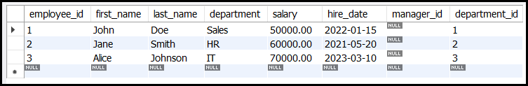

# SQL Basics: SELECT, CREATE, INSERT, UPDATE, and DELETE Statements

SQL (Structured Query Language) is the standard language for interacting with relational databases. The core operations in SQL are often referred to as **CRUD** (Create, Read, Update, Delete). This guide provides a detailed explanation of the `SELECT`, `CREATE`, `INSERT`, `UPDATE`, and `DELETE` statements, along with examples.

---

## **Example Table** ```employees```


---
## SELECT Statement
The `SELECT` statement is used to retrieve data from one or more tables. It is the most commonly used SQL statement.

### Basic Syntax
```sql
SELECT column1, column2, ...
FROM table_name
WHERE condition
ORDER BY column ASC|DESC
LIMIT number;
```

### Examples

#### 1. Retrieving All Columns
```sql
SELECT * FROM employees;
```


This query retrieves all columns from the `employees` table.


#### 2. Retrieving Specific Columns
```sql
SELECT first_name, last_name FROM employees;
```


This query retrieves only the `first_name` and `last_name` columns.

#### 3. Filtering Data with `WHERE`
```sql
SELECT * FROM employees WHERE department = 'Sales';
```


This query retrieves all employees in the Sales department.

#### 4. Sorting Data with `ORDER BY`
```sql
SELECT * FROM employees ORDER BY salary DESC;
```


This query retrieves all employees sorted by salary in descending order.

#### 5. Limiting Results with `LIMIT`
```sql
SELECT * FROM employees LIMIT 3;
```


This query retrieves the first 3 rows from the `employees` table.

#### 6. Aggregating Data with `GROUP BY`
```sql
SELECT department, COUNT(*) AS employee_count
FROM employees
GROUP BY department;
```


This query retrieves the number of employees in each department.

---

## CREATE Statement
The `CREATE` statement is used to create new database objects, such as tables, views, or indexes.

### Basic Syntax for Creating a Table
```sql
CREATE TABLE table_name (
    column1 datatype constraints,
    column2 datatype constraints,
    ...
);
```

### Examples

#### 1. Creating a Table
```sql
CREATE TABLE employees (
    employee_id INT PRIMARY KEY AUTO_INCREMENT,
    first_name VARCHAR(50) NOT NULL,
    last_name VARCHAR(50) NOT NULL,
    department VARCHAR(50),
    salary DECIMAL(10, 2),
    hire_date DATE,
    manager_id INT,
    department_id INT
);
```
This query creates a table named `employees` with columns for employee details.

#### 2. Creating a Table with Constraints
```sql
CREATE TABLE departments (
    department_id INT PRIMARY KEY AUTO_INCREMENT,
    department_name VARCHAR(50) NOT NULL,
    location VARCHAR(50)
);
```
This query creates a `departments` table with a primary key constraint linking `department_id`.

---

## INSERT Statement
The `INSERT` statement is used to add new rows to a table.

### Basic Syntax
```sql
INSERT INTO table_name (column1, column2, ...)
VALUES (value1, value2, ...);
```

### Examples

#### 1. Inserting a Single Row
```sql
INSERT INTO employees (first_name, last_name, department, salary, hire_date, manager_id, department_id)
VALUES ('John', 'Doe', 'Sales', 50000, '2022-01-15', NULL, 1);
```
This query adds a new employee to the `employees` table.

#### 2. Inserting Multiple Rows
```sql
INSERT INTO employees (first_name, last_name, department, salary, hire_date, manager_id, department_id)
VALUES ('John', 'Doe', 'Sales', 50000, '2022-01-15', NULL, 1),
       ('Jane', 'Smith', 'HR', 60000, '2021-05-20', NULL, 2),
       ('Alice', 'Johnson', 'IT', 70000, '2023-03-10', NULL, 3),
       ('Bob', 'Brown', 'Sales', 55000, '2022-11-01', 1, 1),
       ('Charlie', 'Davis', 'Marketing', 65000, '2023-07-22', NULL, 4);
```
This query adds two new employees to the `employees` table.

#### 3. Inserting Data from Another Table
```sql
INSERT INTO new_employees (first_name, last_name, department)
SELECT first_name, last_name, department
FROM employees
WHERE hire_date > '2023-01-01';
```


This query inserts data into `new_employees` from the `employees` table for employees hired after January 1, 2023.

---

## UPDATE Statement
The `UPDATE` statement is used to modify existing rows in a table.

### Basic Syntax
```sql
UPDATE table_name
SET column1 = value1, column2 = value2, ...
WHERE condition;
```

### Examples

#### 1. Updating a Single Row
```sql
UPDATE employees
SET salary = 55000
WHERE employee_id = 3;
```


This query updates the salary of the employee with `employee_id = 101`.

#### 2. Updating Multiple Rows
```sql
UPDATE employees
SET salary = salary * 1.1
WHERE department = 'Sales';
```


This query gives a 10% salary raise to all employees in the Sales department.

---

## DELETE Statement
The `DELETE` statement is used to remove rows from a table.

### Basic Syntax
```sql
DELETE FROM table_name
WHERE condition;
```

### Examples

#### 1. Deleting a Single Row
```sql
DELETE FROM employees
WHERE employee_id = 2;
```


This query deletes the employee with `employee_id = 2`.

#### 2. Deleting Multiple Rows
```sql
DELETE FROM employees
WHERE department = 'IT';
```


This query deletes all employees in the IT department.

#### 3. Deleting All Rows
```sql
DELETE FROM employees;
```


This query deletes all rows from the `employees` table (use with caution!).

---

## Conclusion
The `SELECT`, `CREATE`, `INSERT`, `UPDATE`, and `DELETE` statements are the core of SQL and are used to perform CRUD operations on databases. Here’s a quick summary:

- **SELECT**: Retrieves data from a table.
- **CREATE**: Creates new database objects like tables.
- **INSERT**: Adds new rows to a table.
- **UPDATE**: Modifies existing rows in a table.
- **DELETE**: Removes rows from a table.

---
