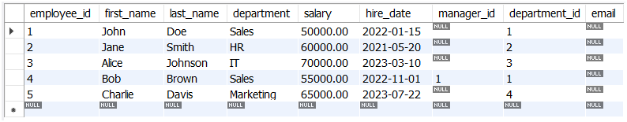
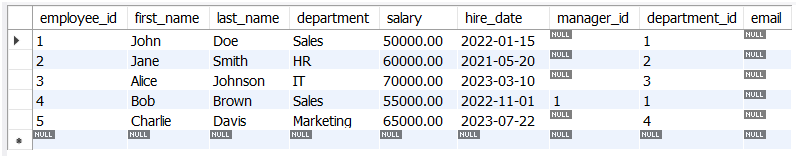
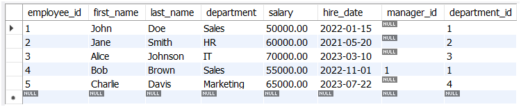
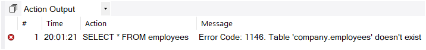
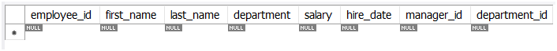

# Data Definition Language (DDL)

**Data Definition Language (DDL)** is a subset of SQL used to define and manage the structure of database objects. DDL commands allow you to create, modify, delete, and manage database structures such as tables, indexes, views, and schemas. These commands are essential for setting up the database schema, defining relationships between tables, and managing the overall structure of the database.

---

## Key DDL Commands
The primary DDL commands are:
1. **CREATE**: Creates new database objects (e.g., tables, indexes, views).
2. **ALTER**: Modifies the structure of existing database objects.
3. **DROP**: Deletes database objects.
4. **TRUNCATE**: Removes all data from a table while keeping the table structure intact.

---

## 1. CREATE Command
The `CREATE` command is used to create new database objects, such as tables, indexes, or views.

### Syntax for Creating a Table
```sql
CREATE TABLE table_name (
    column1 datatype constraints,
    column2 datatype constraints,
    ...
);
```

### Example
```sql
CREATE TABLE employees (
    employee_id INT PRIMARY KEY AUTO_INCREMENT,
    first_name VARCHAR(50) NOT NULL,
    last_name VARCHAR(50) NOT NULL,
    department VARCHAR(50),
    salary DECIMAL(10, 2),
    hire_date DATE,
    manager_id INT,
    department_id INT
);
```
This creates a table named `employees` with columns for employee details.

---

## 2. ALTER Command
The `ALTER` command is used to modify the structure of existing database objects, such as adding, modifying, or dropping columns in a table.

### Syntax for Adding a Column
```sql
ALTER TABLE table_name
ADD column_name datatype constraints;
```

### Example
```sql
ALTER TABLE employees
ADD email VARCHAR(100);
```


This adds an `email` column to the `employees` table.

### Syntax for Modifying a Column
```sql
ALTER TABLE table_name
MODIFY column_name new_datatype constraints;
```

### Example
```sql
ALTER TABLE employees
MODIFY salary DECIMAL(12, 2);
```


This changes the `salary` column to allow up to 12 digits.

### Syntax for Dropping a Column
```sql
ALTER TABLE table_name
DROP COLUMN column_name;
```

### Example
```sql
ALTER TABLE employees
DROP COLUMN email;
```


This removes the `email` column from the `employees` table.

---

## 3. DROP Command
The `DROP` command is used to delete database objects, such as tables, indexes, or views. This operation is irreversible and removes the object and all its data.

### Syntax for Dropping a Table
```sql
DROP TABLE table_name;
```

### Example
```sql
DROP TABLE employees;
```


This deletes the `employees` table and all its data.

---

## 4. TRUNCATE Command
The `TRUNCATE` command removes all rows from a table but retains the table structure. It is faster than `DELETE` for large tables because it does not log individual row deletions.

### Syntax
```sql
TRUNCATE TABLE table_name;
```

### Example
```sql
TRUNCATE TABLE employees;
```


This removes all rows from the `employees` table but keeps the table structure intact.

---

## Summary of DDL Commands
| Command                  | Description                                      | Example                              |
|--------------------------|--------------------------------------------------|--------------------------------------|
| `CREATE TABLE`           | Creates a new table.                             | `CREATE TABLE employees (...);`     |
| `ALTER TABLE ADD`        | Adds a new column to a table.                    | `ALTER TABLE employees ADD email;`  |
| `ALTER TABLE MODIFY`     | Modifies an existing column in a table.          | `ALTER TABLE employees MODIFY salary;` |
| `ALTER TABLE DROP`       | Removes a column from a table.                   | `ALTER TABLE employees DROP email;` |
| `DROP TABLE`             | Deletes a table and all its data.                | `DROP TABLE employees;`             |
| `TRUNCATE TABLE`         | Removes all rows from a table but keeps the structure. | `TRUNCATE TABLE employees;`       |

---

## Key Points to Remember
1. **Immediate Changes**: DDL commands make immediate changes to the database structure.
2. **Irreversible Operations**: Commands like `DROP` and `TRUNCATE` are irreversible and should be used with caution.
3. **Schema Management**: DDL is primarily used for defining and managing the database schema.
4. **Data Impact**: While `CREATE` and `ALTER` do not directly affect data, `DROP` and `TRUNCATE` can result in data loss.

---

## Conclusion
DDL commands (`CREATE`, `ALTER`, `DROP`, `TRUNCATE`) are essential for defining and managing the structure of a database. They allow you to:
- Create new database objects.
- Modify existing objects.
- Delete objects or remove data.

---

