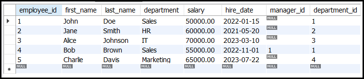

# DDL `CREATE TABLE` Command

The `CREATE TABLE` command is one of the most fundamental **Data Definition Language (DDL)** commands in SQL. It is used to define and create a new table in a database. A table is a structured collection of data organized into rows and columns, where each column has a specific data type and constraints.

---

## **Example Table**



---

## Syntax of `CREATE TABLE`
The basic syntax for the `CREATE TABLE` command is as follows:

```sql
CREATE TABLE table_name (
    column1 datatype constraints,
    column2 datatype constraints,
    ...
    table_constraints
);
```

### Components of the Syntax
1. **`table_name`**: The name of the table you want to create.
2. **`column1, column2, ...`**: The names of the columns in the table.
3. **`datatype`**: The data type of the column (e.g., `INT`, `VARCHAR`, `DATE`).
4. **`constraints`**: Optional rules applied to the column (e.g., `PRIMARY KEY`, `NOT NULL`, `UNIQUE`).
5. **`table_constraints`**: Optional rules applied to the entire table (e.g., `PRIMARY KEY`, `FOREIGN KEY`).

---

## Key Components of `CREATE TABLE`

### 1. **Column Definitions**
Each column in the table must have:
- A **name** (e.g., `employee_id`, `first_name`).
- A **data type** (e.g., `INT`, `VARCHAR(50)`, `DATE`).
- Optional **constraints** (e.g., `NOT NULL`, `UNIQUE`).

#### Example
```sql
CREATE TABLE employees (
    employee_id INT,
    first_name VARCHAR(50),
    last_name VARCHAR(50),
    hire_date DATE
);
```
This creates a table named `employees` with four columns: `employee_id`, `first_name`, `last_name`, and `hire_date`.

---

### 2. **Data Types**
Data types define the kind of data a column can store. Common data types include:
- **Numeric**: `INT`, `DECIMAL`, `FLOAT`.
- **String**: `VARCHAR`, `CHAR`, `TEXT`.
- **Date/Time**: `DATE`, `TIME`, `DATETIME`.
- **Boolean**: `BOOLEAN`.
- **Binary**: `BLOB`, `BINARY`.

#### Example
```sql
CREATE TABLE products (
    product_id INT,
    product_name VARCHAR(100),
    price DECIMAL(10, 2),
    is_available BOOLEAN
);
```
This creates a table named `products` with columns for `product_id`, `product_name`, `price`, and `is_available`.

---

### 3. **Column Constraints**
Constraints enforce rules on the data in a column. Common constraints include:
- **`PRIMARY KEY`**: Uniquely identifies each row in the table.
- **`NOT NULL`**: Ensures the column cannot have `NULL` values.
- **`UNIQUE`**: Ensures all values in the column are unique.
- **`DEFAULT`**: Sets a default value for the column if no value is provided.
- **`CHECK`**: Ensures the column values meet a specific condition.

#### Example
```sql
CREATE TABLE students (
    student_id INT PRIMARY KEY,
    first_name VARCHAR(50) NOT NULL,
    last_name VARCHAR(50) NOT NULL,
    age INT CHECK (age >= 18),
    enrollment_date DATE DEFAULT CURRENT_DATE
);
```
This creates a table named `students` with constraints:
- `student_id` is the primary key.
- `first_name` and `last_name` cannot be `NULL`.
- `age` must be 18 or older.
- `enrollment_date` defaults to the current date if not provided.

---

### 4. **Table Constraints**
Table constraints apply to the entire table rather than individual columns. Common table constraints include:
- **`PRIMARY KEY`**: Defines a primary key using one or more columns.
- **`FOREIGN KEY`**: Defines a relationship between tables.
- **`UNIQUE`**: Ensures a combination of columns has unique values.

#### Example
```sql
CREATE TABLE orders (
    order_id INT,
    product_id INT,
    quantity INT,
    PRIMARY KEY (order_id),
    FOREIGN KEY (product_id) REFERENCES products(product_id)
);
```
This creates a table named `orders` with:
- A primary key on `order_id`.
- A foreign key on `product_id` that references the `products` table.

---

## Advanced Features of `CREATE TABLE`

### 1. **Composite Primary Key**
A primary key can be defined using multiple columns.

#### Example
```sql
CREATE TABLE order_items (
    order_id INT,
    product_id INT,
    quantity INT,
    PRIMARY KEY (order_id, product_id)
);
```
Here, the combination of `order_id` and `product_id` forms the primary key.

---

### 2. **Auto-Increment Columns**
Some databases (e.g., MySQL) support auto-incrementing columns, which automatically generate a unique value for each row.

#### Example (MySQL)
```sql
CREATE TABLE employees (
    employee_id INT AUTO_INCREMENT PRIMARY KEY,
    first_name VARCHAR(50),
    last_name VARCHAR(50)
);
```
The `employee_id` column will automatically increment for each new row.

---

### 3. **Creating a Table from Another Table**
You can create a new table based on the structure and data of an existing table.

#### Example
```sql
CREATE TABLE new_employees AS
SELECT * FROM employees
WHERE hire_date > '2023-01-01';
```
This creates a new table named `new_employees` with the same structure as `employees` and copies rows where `hire_date` is after January 1, 2023.

---

## Example: Full `CREATE TABLE` Command
```sql
CREATE TABLE employees (
    employee_id INT PRIMARY KEY,
    first_name VARCHAR(50) NOT NULL,
    last_name VARCHAR(50) NOT NULL,
    hire_date DATE,
    salary DECIMAL(10, 2) CHECK (salary > 0),
    department_id INT,
    FOREIGN KEY (department_id) REFERENCES departments(department_id)
);
```
This creates a table named `employees` with:
- A primary key on `employee_id`.
- `first_name` and `last_name` that cannot be `NULL`.
- A `salary` column that must be greater than 0.
- A foreign key on `department_id` that references the `departments` table.

---

## Conclusion
The `CREATE TABLE` command is a powerful tool for defining the structure of a database table. It allows you to:
- Specify column names, data types, and constraints.
- Define primary keys, foreign keys, and other table-level constraints.
- Create tables with advanced features like auto-incrementing columns.

---
