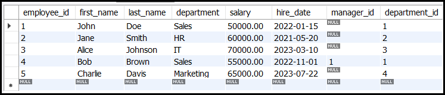

# DDL `ALTER` Command

The `ALTER` command is a **Data Definition Language (DDL)** statement used to modify the structure of an existing database object, such as a table. It allows you to add, modify, or drop columns, constraints, and other properties of a table without needing to recreate it. The `ALTER` command is essential for maintaining and evolving the database schema as requirements change.

---

## **Example Table** ```employees```


---

## Syntax of `ALTER TABLE`
The basic syntax for the `ALTER TABLE` command is as follows:

```sql
ALTER TABLE table_name
ACTION;
```

Here, `ACTION` can be one of the following:
- **Add a column**: `ADD column_name datatype constraints`
- **Modify a column**: `MODIFY column_name new_datatype constraints`
- **Rename a column**: `RENAME COLUMN old_name TO new_name`
- **Drop a column**: `DROP COLUMN column_name`
- **Add a constraint**: `ADD CONSTRAINT constraint_name constraint_definition`
- **Drop a constraint**: `DROP CONSTRAINT constraint_name`
- **Rename a table**: `RENAME TO new_table_name`

---

## Key Actions of `ALTER TABLE`

### 1. **Adding a Column**
You can add a new column to an existing table.

#### Syntax
```sql
ALTER TABLE table_name
ADD column_name datatype constraints;
```

#### Example
```sql
ALTER TABLE employees
ADD email VARCHAR(100);
```


This adds a new column named `email` of type `VARCHAR(100)` to the `employees` table.

---

### 2. **Modifying a Column**
You can change the data type or constraints of an existing column.

#### Syntax
```sql
ALTER TABLE table_name
MODIFY column_name new_datatype constraints;
```

#### Example
```sql
ALTER TABLE employees
MODIFY salary DECIMAL(12, 2);
```


This changes the `salary` column to allow up to 12 digits with 2 decimal places.

---

### 3. **Renaming a Column**
You can rename an existing column in a table.

#### Syntax
```sql
ALTER TABLE table_name
RENAME COLUMN old_name TO new_name;
```

#### Example
```sql
ALTER TABLE employees
RENAME COLUMN email TO work_email;
```


This renames the `email` column to `work_email`.

---

### 4. **Dropping a Column**
You can remove a column from a table.

#### Syntax
```sql
ALTER TABLE table_name
DROP COLUMN column_name;
```

#### Example
```sql
ALTER TABLE employees
DROP COLUMN work_email;
```


This removes the `work_email` column from the `employees` table.

---

### 5. **Adding a Constraint**
You can add constraints like `PRIMARY KEY`, `FOREIGN KEY`, `UNIQUE`, or `CHECK` to a table.

#### Syntax
```sql
ALTER TABLE table_name
ADD CONSTRAINT constraint_name constraint_definition;
```

#### Example
```sql
ALTER TABLE employees
ADD CONSTRAINT pk_employee_id PRIMARY KEY (employee_id);
```
This adds a primary key constraint to the `employee_id` column.

---

### 6. **Dropping a Constraint**
You can remove an existing constraint from a table.

#### Syntax
```sql
ALTER TABLE table_name
DROP CONSTRAINT constraint_name;
```

#### Example
```sql
ALTER TABLE employees
DROP CONSTRAINT pk_employee_id;
```
This removes the primary key constraint from the `employee_id` column.

---

### 7. **Renaming a Table**
You can rename an existing table.

#### Syntax
```sql
ALTER TABLE table_name
RENAME TO new_table_name;
```

#### Example
```sql
ALTER TABLE employees
RENAME TO staff;
```


This renames the `employees` table to `staff`.

---

## Advanced Usage of `ALTER TABLE`

### 1. **Adding a Foreign Key**
You can add a foreign key constraint to establish a relationship between tables.

#### Example
```sql
ALTER TABLE orders
ADD CONSTRAINT fk_customer_id
FOREIGN KEY (customer_id) REFERENCES customers(customer_id);
```
This adds a foreign key constraint on the `customer_id` column in the `orders` table, referencing the `customer_id` column in the `customers` table.

---

### 2. **Dropping a Default Value**
You can remove the default value from a column.

#### Example
```sql
ALTER TABLE employees
ALTER COLUMN hire_date DROP DEFAULT;
```
This removes the default value from the `hire_date` column.

---

## Example: Full `ALTER TABLE` Workflow

### Step 1: Create a Table
```sql
CREATE TABLE employees (
    employee_id INT,
    first_name VARCHAR(50),
    last_name VARCHAR(50),
    hire_date DATE
);
```

### Step 2: Add a Column
```sql
ALTER TABLE employees
ADD email VARCHAR(100);
```

### Step 3: Modify a Column
```sql
ALTER TABLE employees
MODIFY first_name VARCHAR(100);
```

### Step 4: Add a Primary Key
```sql
ALTER TABLE employees
ADD CONSTRAINT pk_employee_id PRIMARY KEY (employee_id);
```

### Step 5: Rename the Table
```sql
ALTER TABLE employees
RENAME TO staff;
```

---

## Conclusion
The `ALTER TABLE` command is a powerful tool for modifying the structure of an existing table. It allows you to:
- Add, modify, or drop columns.
- Add or drop constraints.
- Rename tables or columns.


---
